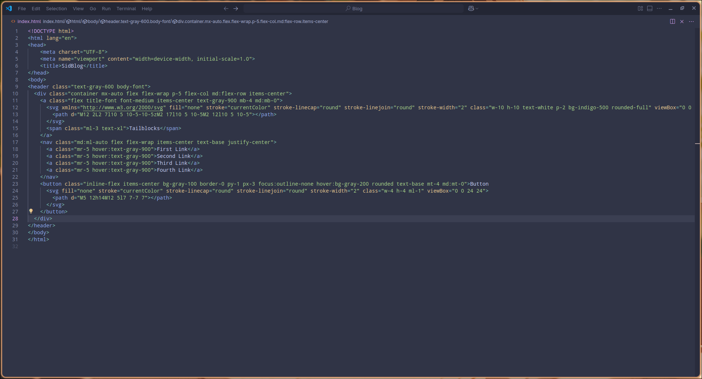
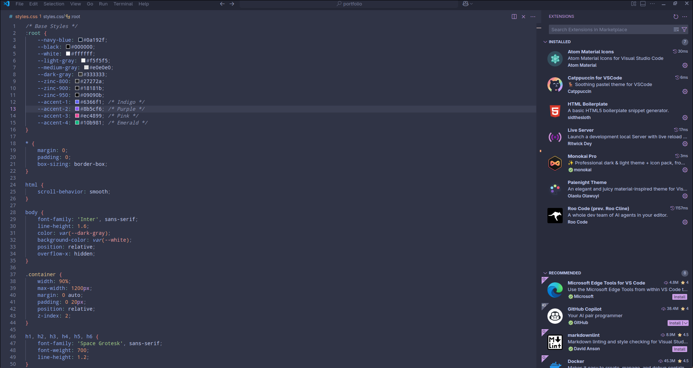
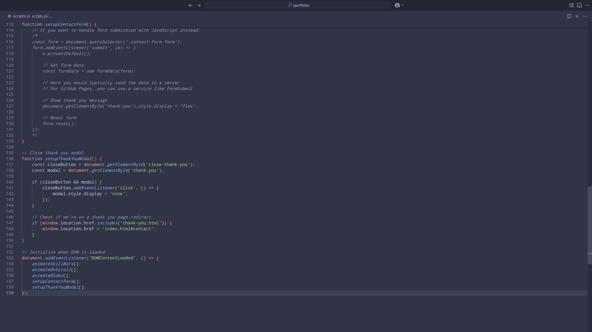
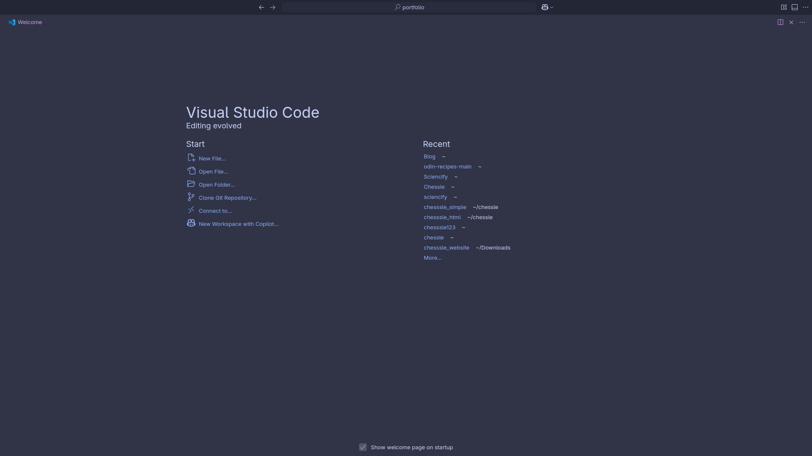

# VSCode Config Backup

This repository contains backup copies of my Visual Studio Code configuration files, along with some sample images for demonstration.

## Files Included

- `settings.json` — My VSCode user settings.
- `keybindings.json` — Custom keybindings for VSCode.

## Sample Images

Here are some sample images included in the repo:

## Usage

You can replace your current VSCode settings and keybindings by copying these files to the appropriate directory:

- On Linux/macOS: `~/.config/Code/User/`
- On Windows: `%APPDATA%\\Code\\User\\`

Make sure to back up your existing files before replacing them.

## License

Feel free to use and modify these files as needed.

